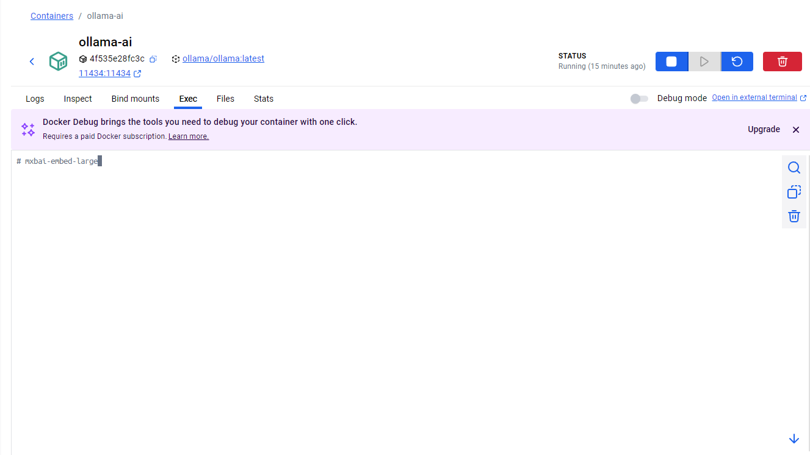
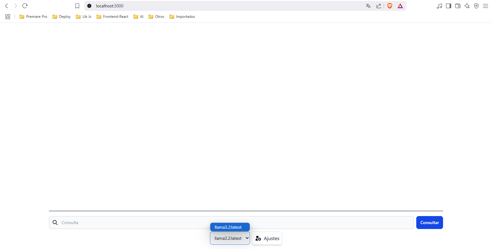
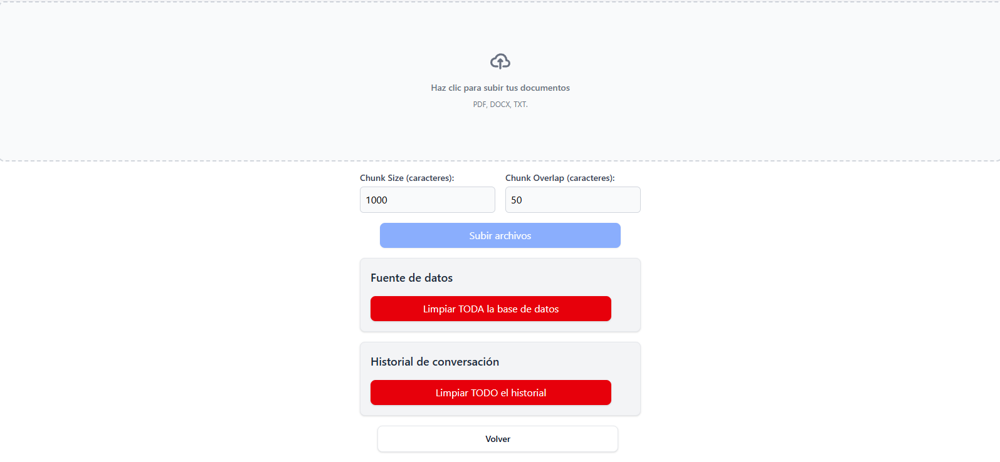

# 🔍 RAG Local API - FastAPI + LangChain + Ollama + Chroma

Este proyecto implementa una API local de Recuperación Aumentada por Generación (RAG) usando:

- 🧠 **FastAPI** para el backend
- 🔗 **LangChain** para orquestar la lógica RAG
- 🦙 **Ollama** para correr modelos LLM y de embeddings localmente
- 🧠 **ChromaDB** como base vectorial para recuperación semántica
- 🐳 **Docker Compose** para contenerizar todo
- 🌐 **Redis** para almacenamiento temporal del historial de conversación.

## 🐳 Requisitos previos
- [Docker](https://www.docker.com/)
---

## 🚀 Funcionalidades principales

✅ Ingesta de documentos (.pdf, .docx, .txt)
✅ Fragmentación automática de texto (con RecursiveCharacterTextSplitter)
✅ Indexación en base vectorial con embeddings (mxbai-embed-large)
✅ Recuperación contextual con búsqueda MMR
✅ Generación de respuestas enriquecidas con contexto y memoria
✅ Soporte multi-modelo: puedes elegir entre distintos modelos Ollama
✅ Endpoints para listar, resetear y gestionar historial
✅ Documentación automática con Swagger UI

## Endpoints principales
- `POST /ingest`: Subida y fragmentación de documentos
- `POST /ask_model`: Consulta a un modelo con contexto y memoria
- `GET /models`: Lista los modelos de chat disponibles en Ollama
- `GET /history`: Obtiene el historial de conversación
- `POST /clearHistory`: Elimina el historial
- `DELETE /reset_embeddings`: Elimina la base vectorial completa

## ⚙️ Tecnologías principales

- LLM: `llama3.2:latest` o el de tu preferencia
- Embeddings: `mxbai-embed-large`
- Backend API: FastAPI
- Vector store: Chroma
- Gestión de prompts y memoria contextual: LangChain

---


## 🚀 Paso a paso para levantar el proyecto

### 1. Clona el repositorio

```bash
git clone https://github.com/YonierGM/ollama-rag-chat
cd ollama-rag-chat
```

### 2. Construir contenedores y levantar proyecto
```bash
docker compose up --build
```

### 3. Instalar modelos en el contenedor de ollama
- Modelo de embeddings `mxbai-embed-large`
- modelo LLM `llama3.2`

Accede al contenedor de ollama `Containers/ollama-ai` y ejecutar los comandos:

### Referencia


Comandos:
```bash
ollama pull mxbai-embed-large
ollama run llama3.2
```

Una vez que hayas instalado los modelos de embeddings y LLM, puedes elegir cuál utilizar desde el selector ubicado en la esquina inferior izquierda de la interfaz. Siéntete libre de probar diferentes modelos que hayas instalado.

### Interfaz principal


### embeddings y borrado


